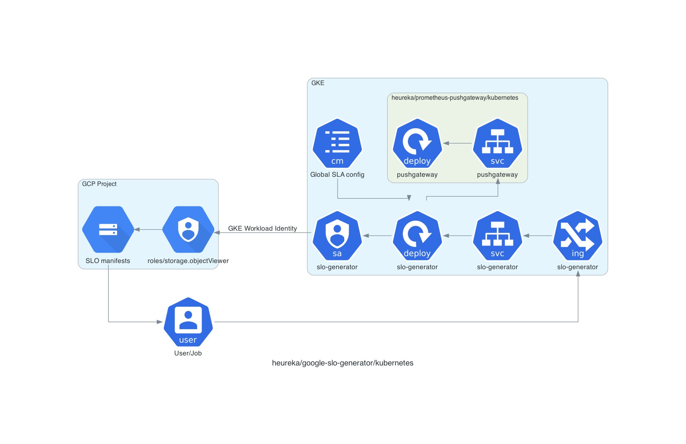

# terraform-kubernetes-google-slo-generator

An extremely opinionated module, that deploys [omni-slo-generator][omni-slo-gnerator]
based on Google's [SLO generator][slo-generator] into GKE.

## Assumptions made

* Prometheus backend is a mimir cluster
  * Mimir is running in monitoring namespace and has a nginx pod `mimir-nginx` for proxying (as mimir helm chart does it)
  * This can be overridden variable `prometheus-backend-url`
* You want to keep the default policies as shown in slo-exporter's examples (1h, 12h, 7d, 28d)
* You are using ingress nginx controller (this is configurable)
* GKE cluster has [workload identity][workload identity] enabled
* You are running prometheus operator (`monitoring.coreos.com/v1` in your cluster)

## Diagram



***Note***: Ingress is deployed optionally, if you want to run your job inside kubernetes,
you don't need to expose it outside the cluster.

## Usage

```terraform
module "slo-generator" {
  source = "heureka/google-slo-generator/kubernetes"
  version = "2.0.3"

  gke-project     = "company-k8s"
  storage-project = "todo-app"
  namespace       = "todo-app"
  ingress-host    = "slo-generator.example.com"  # optional
  bucket-name     = "company-todo-app-slos"
}
```

After that, you can upload your [SLO manifests][slo config]
to the SLOs bucket, which the generator will automatically go through and 
calculate SLOs for

### Additional configuration

Please check the input tab of [this module's page][input tab] on terraform 
registry to see all available options and their descriptions. 

To pass extra environment variables to the generator container, use `extra-env`
for plain values and `env-from-secrets` to inject existing Kubernetes Secrets via
`envFrom`:

```terraform
  extra-env = {
    SOME_FLAG = "true"
  }

  env-from-secrets = ["my-synced-secret"]
```

The Secrets named in `env-from-secrets` must already exist in the namespace when
the deployment rolls out — the module references them by name and cannot order
its rollout after a Secret it does not manage, so a pod consuming a not-yet-ready
Secret will sit in `CreateContainerConfigError` until it appears. Note also that
`envFrom` precedence between multiple referenced Secrets is not guaranteed (keys
are deduplicated, not ordered), so avoid relying on one Secret overriding a key
of another.

### Wiki documentation

The generator can publish per-team documentation to Confluence. Enabling it
syncs the Confluence credentials from Vault into a Kubernetes Secret (via the
[External Secrets Operator][eso]) and wires them into the container, so each
consuming team only sets two inputs:

```terraform
  wiki-enabled = true
  team         = "my-team"
```

**Prerequisites.** The [External Secrets Operator][eso] must be installed in the
cluster — the module creates an `ExternalSecret` (`external-secrets.io/v1beta1`)
and that CRD has to exist, otherwise `terraform plan` fails to resolve the
resource. The namespace also needs a `SecretStore` (named after the namespace by
default) with read access to the credentials' Vault path.

When enabled, terraform waits for the operator to report the `ExternalSecret` as
Ready (so the backing Secret exists before the generator rolls out) and fails the
apply if that does not happen within `wiki-secret-wait-timeout`. This wait
applies only when `wiki-enabled = true`; with the feature off the core
deployment has no dependency on it.

The Vault key, the property names read from it, the store name/kind, the refresh
interval and the wait timeout can all be overridden — see
`wiki-confluence-vault-key`, `wiki-confluence-secret-keys`,
`wiki-secret-store-name`, `wiki-secret-store-kind` (use `ClusterSecretStore` for
a cluster-scoped store), `wiki-secret-refresh-interval` and
`wiki-secret-wait-timeout` in the inputs.

The properties in `wiki-confluence-secret-keys` are org-wide, per-environment
values shared by all teams, hence in the common Vault key: the `CONFLUENCE_*`
values route every team under one Confluence tree per environment, and
`OMNI_SLO_GENERATOR_GRAFANA_ENV` is the Grafana `var-env` UID the dashboard links
point at. All listed properties must exist under the Vault key, or the
`ExternalSecret` fails to sync and the apply trips `wiki-secret-wait-timeout`.

[eso]: https://external-secrets.io/
[omni-slo-generator]: https://github.com/heureka/omni-slo-generator
[slo-generator]: https://github.com/google/slo-generator/
[input tab]: https://registry.terraform.io/modules/heureka/google-slo-generator/kubernetes/latest?tab=inputs
[workload identity]: https://cloud.google.com/kubernetes-engine/docs/how-to/workload-identity
[slo config]: https://github.com/google/slo-generator/#slo-configuration
