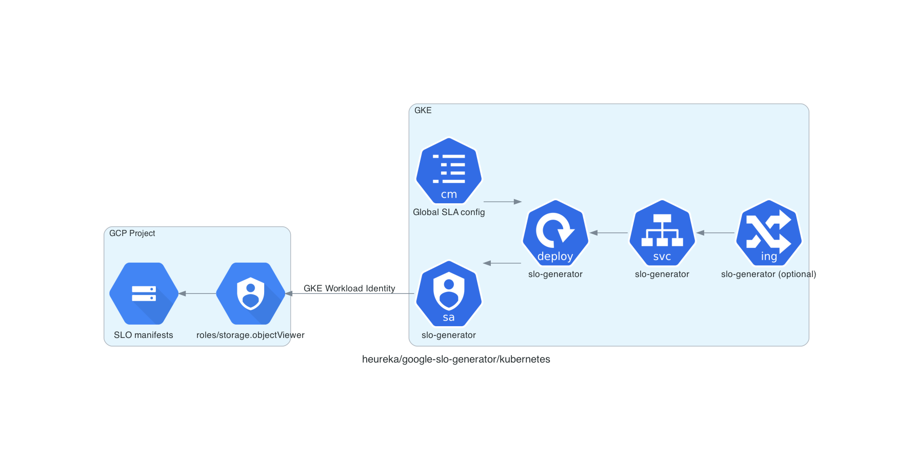

# terraform-kubernetes-google-slo-generator

An extremely opinionated module, that deploys Google's 
[SLO generator][slo-generator] into GKE.

## Assumptions made

* Prometheus backend is a cortex cluster (without multi tenancy)
  * Cortex is running in monitoring namespace and has a nginx pod `cortex-nginx` for proxying (as cortex helm chart does it)
  * This can be overridden variable `prometheus-backend-url`
* Exporter is a pushgateway deployed by this module (might change if [this][expose self pr] gets merged)
* You want to keep the default policies as shown in slo-exporter's examples (1h, 12h, 7d, 28d)
* You are using ingress nginx controller (this is configurable)
* GKE cluster has [workload identity][workload identity] enabled
* You are running prometheus operator (`monitoring.coreos.com/v1` in your cluster)

## Diagram



***Note***: Ingress is deployed optionally, if you want to run your job inside kubernetes,
you don't need to expose it outside the cluster.

## Usage

```terraform
module "slo-generator" {
  source = "heureka/google-slo-generator/kubernetes"
  version = "1.0.2"

  gke-project     = "company-k8s"
  storage-project = "todo-app"
  namespace       = "todo-app"
  ingress-host    = "slo-generator.example.com"  # optional
  bucket-name     = "company-todo-app-slos"
}
```

After that, you can upload your [SLO manifests][slo config]
to the SLOs bucket, create a job to periodically send following http requests:

```shell
# single SLO
curl -X POST -d "gs://my-unique-slos/slo.yaml" http://slo-generator.example.com
# batched request
curl -X POST -d "gs://my-unique-slos/slo.yaml;gs://my-unique-slos/slo2.yaml" http://slo-generator.example.com/?batch=true
```

### Additional configuration

Please check the input tab of [this module's page][input tab] on terraform 
registry to see all available options and their descriptions. 

[slo-generator]: https://github.com/google/slo-generator/
[input tab]: https://registry.terraform.io/modules/heureka/google-slo-generator/kubernetes/latest?tab=inputs
[expose elf pr]: https://github.com/google/slo-generator/pull/209
[workload identity]: https://cloud.google.com/kubernetes-engine/docs/how-to/workload-identity
[slo config]: https://github.com/google/slo-generator/#slo-configuration
